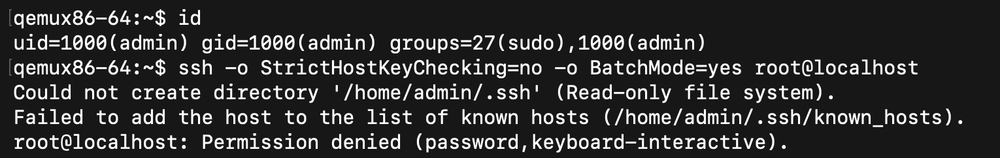
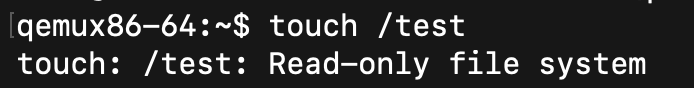
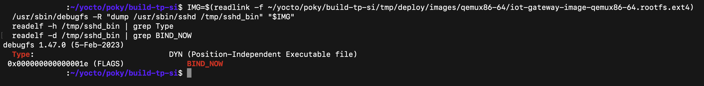
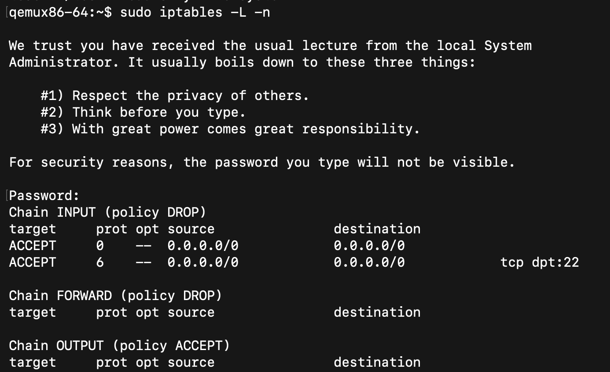

% Rapport d'audit de securite - Passerelle IoT durcie
% Groupe 9 (M2 SI, ESGI)
%

# Contexte

En partant de `core-image-base`, on a construit une image Linux durcie pour une passerelle IoT sur Yocto Scarthgap 5.0 (cible `qemux86-64`). Toutes nos modifications sont regroupees dans le layer `meta-iot-gateway-hardened` (fourni dans ce depot). Ce rapport decrit les mesures de durcissement, les preuves de leur efficacite, puis l'analyse de deux CVE "High" remontees par `cve-check`.

# Mesures de durcissement

## Acces root et SSH

Le compte root est verrouille (`usermod -L`, ce qui donne `root:!*` dans `/etc/shadow`) et le serveur SSH refuse toute connexion root (`PermitRootLogin no`, fourni via un `.bbappend` sur openssh). On se connecte avec un compte `admin` non privilegie, membre du groupe `sudo`.

Preuve : une tentative de connexion SSH en root est refusee (`Permission denied`), alors que la connexion `admin` fonctionne.

{width=15cm}

## Systeme de fichiers en lecture seule

L'image active `read-only-rootfs`. La racine est montee `ro`, toute ecriture echoue.

Preuve : `touch /test` renvoie `Read-only file system`.

{width=15cm}

## Durcissement du compilateur

On active `security_flags.inc` dans `local.conf`, ce qui applique `-fstack-protector-strong`, `-D_FORTIFY_SOURCE=2`, RELRO/BIND_NOW et PIE a l'ensemble du systeme.

Preuve : `readelf` sur `/usr/sbin/sshd` montre un binaire PIE avec Full RELRO (`BIND_NOW`).

{width=15cm}

## Pare-feu

Une recette `firewall-config` installe un script `init.d` (via la classe `update-rc.d`) qui, au demarrage, met la politique `INPUT` a `DROP` et n'autorise que le loopback, les connexions deja etablies et le SSH (port 22).

Preuve : `sudo iptables -L -n` sur la cible montre la politique `DROP` et les regles.

{width=15cm}

## Analyse de vulnerabilites

`cve-check` croise les paquets de l'image avec la base NVD. Les rapports sont generes dans `tmp/deploy/cve/` (un fichier par recette, plus un resume au niveau de l'image). Notre image remonte **760 CVE non corrigees**, dont **265 classees High ou Critical** (27 en Critical, CVSS superieur ou egal a 9.0).

# Analyse de deux CVE "High"

## CVE-2026-5450 - glibc (CVSS 9.8)

La famille de fonctions `scanf`, appelee avec un `%mc` et une largeur explicite superieure a 1024, provoque un depassement d'un octet dans le tas (glibc 2.7 a 2.43 ; notre image est en 2.39). Le vecteur est reseau, avec un impact eleve sur la confidentialite, l'integrite et la disponibilite. Comme glibc est utilise par presque tous les binaires, c'est la vulnerabilite la plus critique de l'image.

Remediation : mettre a jour la recette glibc vers une version corrigee (2.44 ou plus), ou plus simplement recuperer le point release Scarthgap qui backporte le correctif upstream (les LTS recoivent ces correctifs de securite). En attendant, on peut backporter le patch amont via un `.bbappend` qui ajoute le `.patch` au `SRC_URI` de glibc.

## CVE-2026-60002 - openssh (CVSS 7.7)

Use-after-free cote client SSH lorsqu'un serveur change sa cle d'hote pendant une re-negociation de cle (OpenSSH avant 10.4 ; notre image est en 9.6p1).

Notre exposition reelle est faible : la passerelle fait tourner le serveur (`sshd`) et n'initie pas de connexions ssh sortantes, alors que la faille est cote client. Le risque concret reste donc limite tant qu'on n'utilise pas le client `ssh` de la passerelle vers des serveurs non maitrises.

Remediation : mettre openssh a jour (>= 10.4) via le point release Scarthgap, ou marquer la CVE avec `CVE_STATUS` en justifiant sa non-applicabilite cote serveur.

# Conclusion

L'image repond aux exigences : root inaccessible en local comme a distance, rootfs immuable, binaires durcis, pare-feu strict, et visibilite sur les CVE. Le principal chantier restant est la mise a jour reguliere des paquets pour reduire les 265 CVE High, en priorite glibc et le noyau. Le layer complet est disponible dans ce depot (voir le README pour l'integration).
